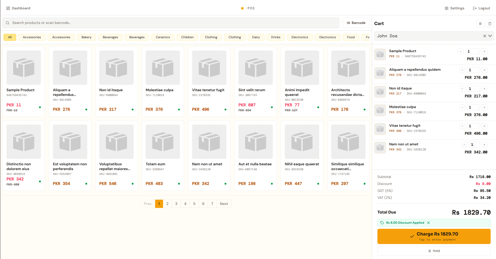
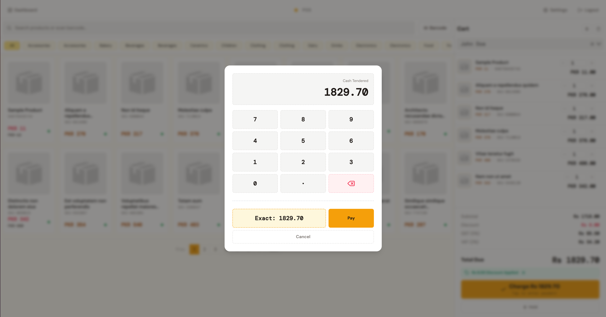
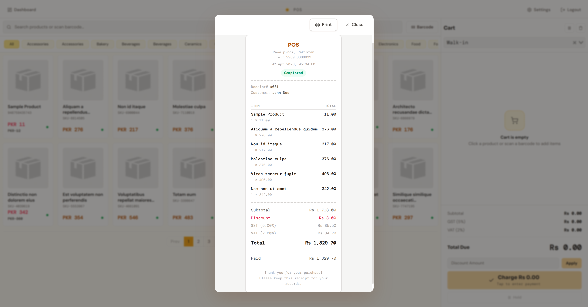
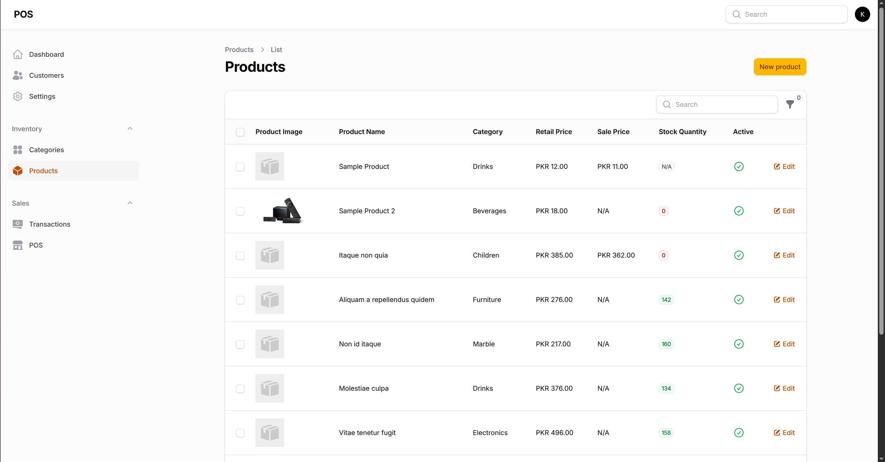
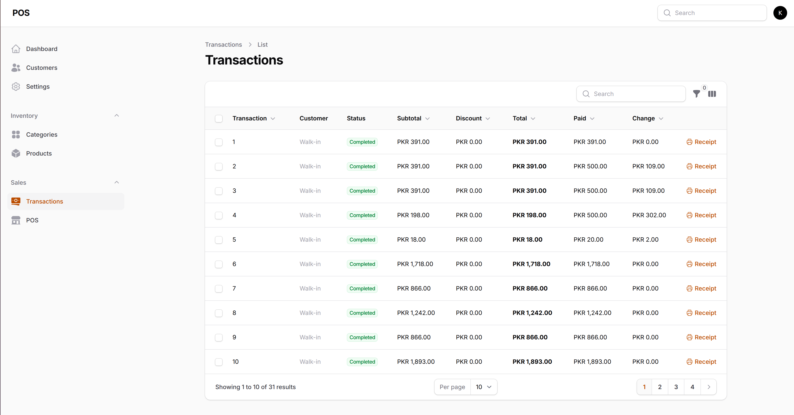
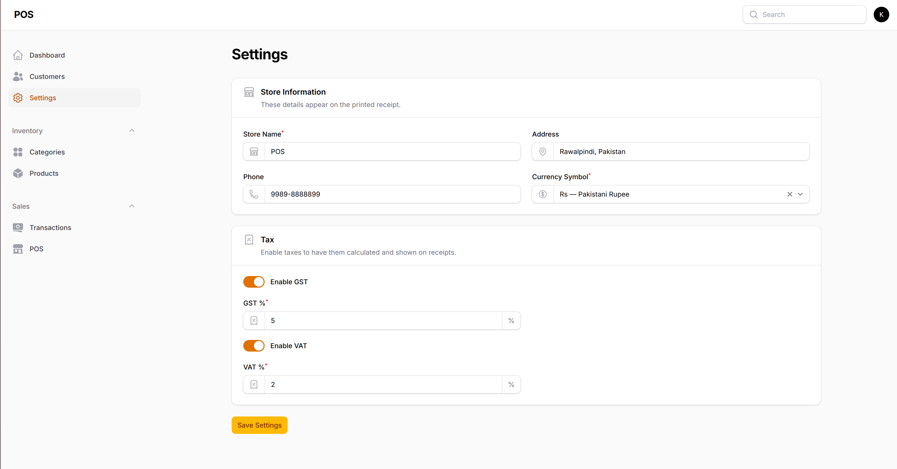

# Point of Sale System

A fast and simple point of sale system for small businesses. Manage products, process sales, and track transactions all in one place.

---

## Checkout

Quickly search for products, add them to cart, apply discounts, and complete sales in seconds. Every transaction generates a professional receipt with your store details and taxes.

---

## Products & Inventory

Keep your product catalog organized with categories, pricing, and stock levels. Get alerts before you run out of stock.

---

## Transactions

View your full sales history, revisit past receipts, and stay on top of your business performance.

---

## Settings

Configure your store name, address, currency, and tax rates (GST/VAT) — all reflected automatically on receipts.

